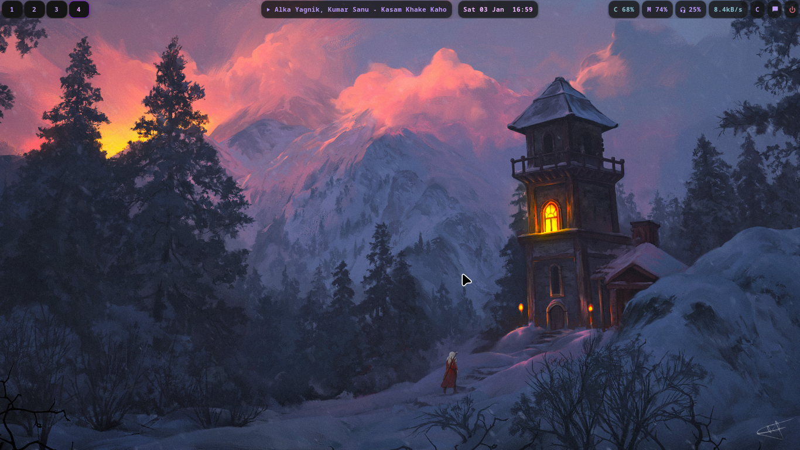
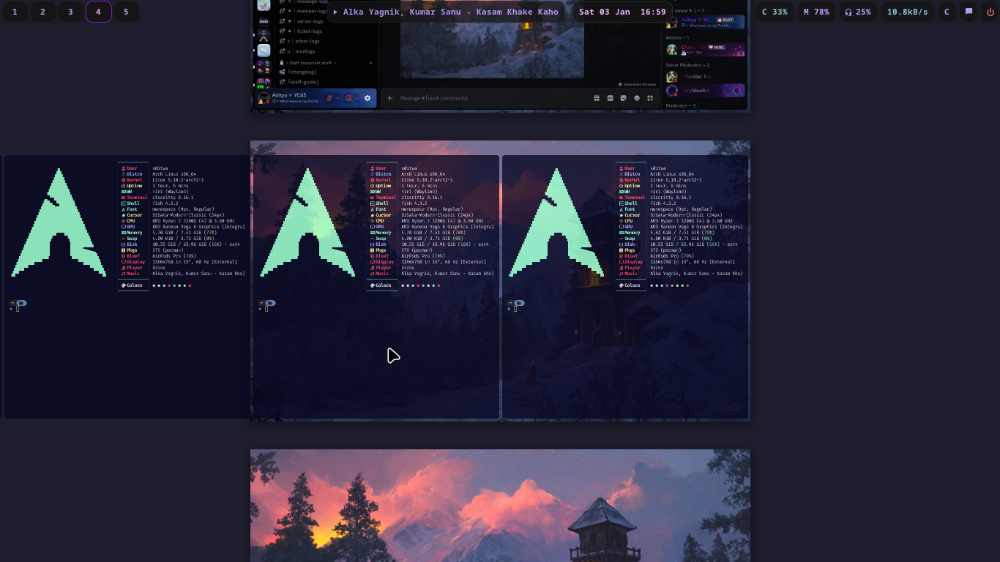
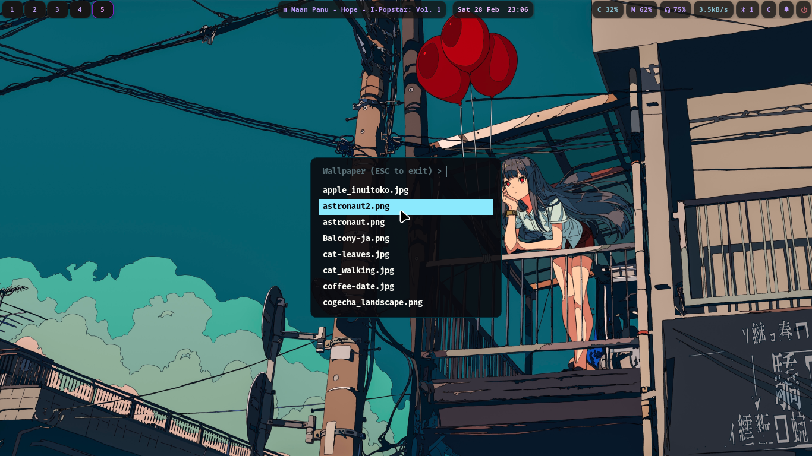
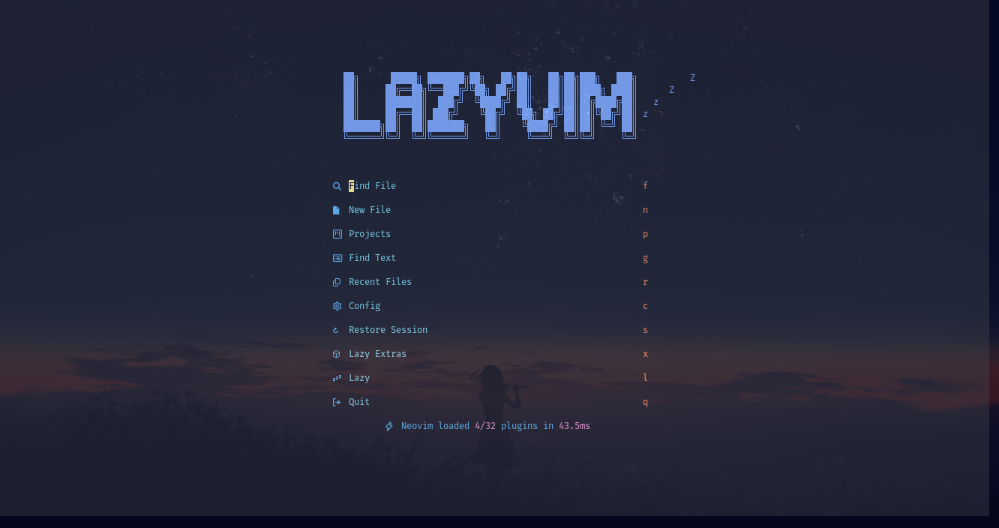
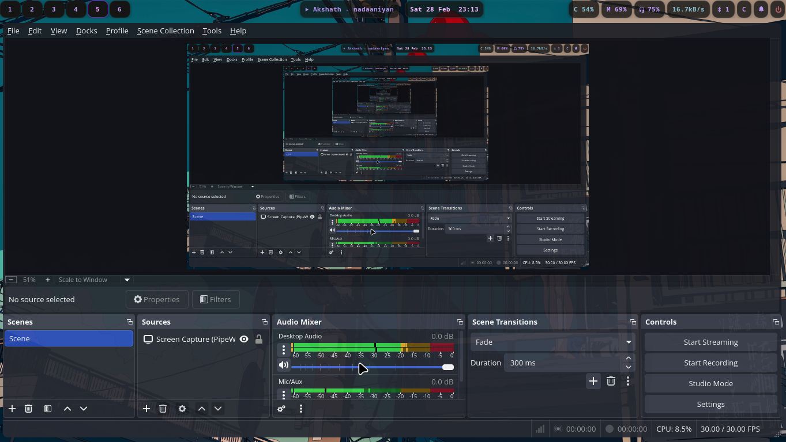
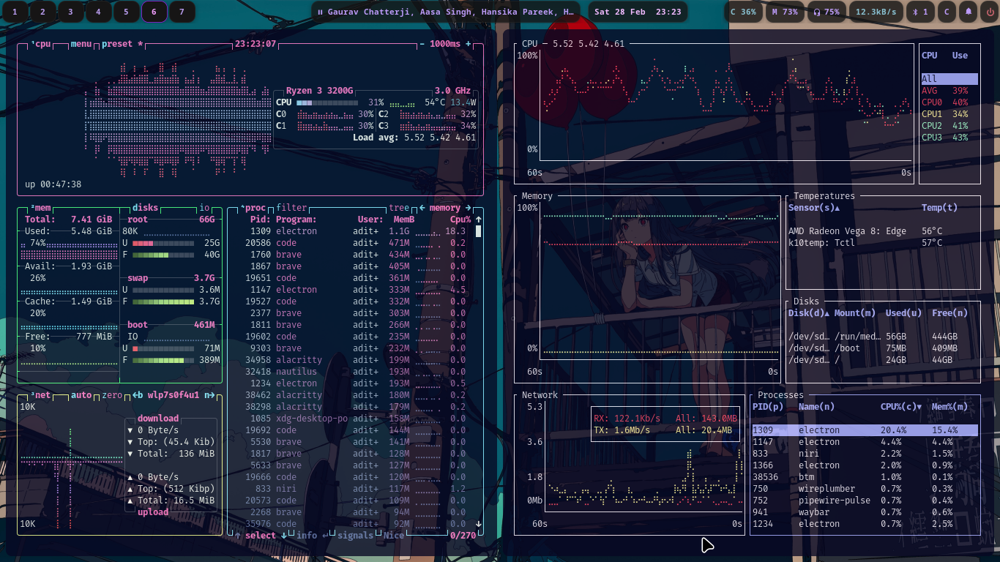
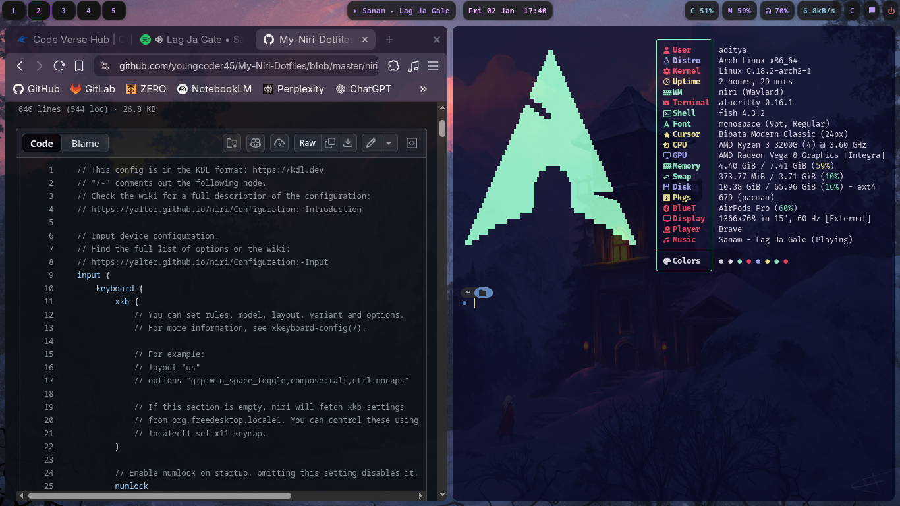
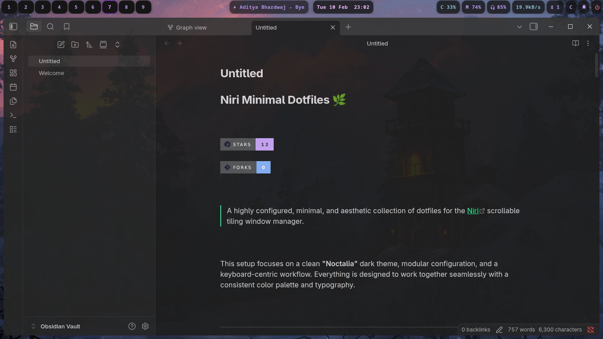
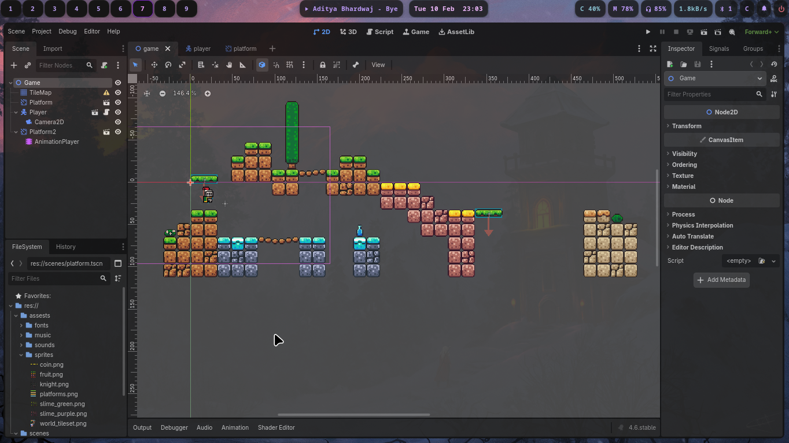
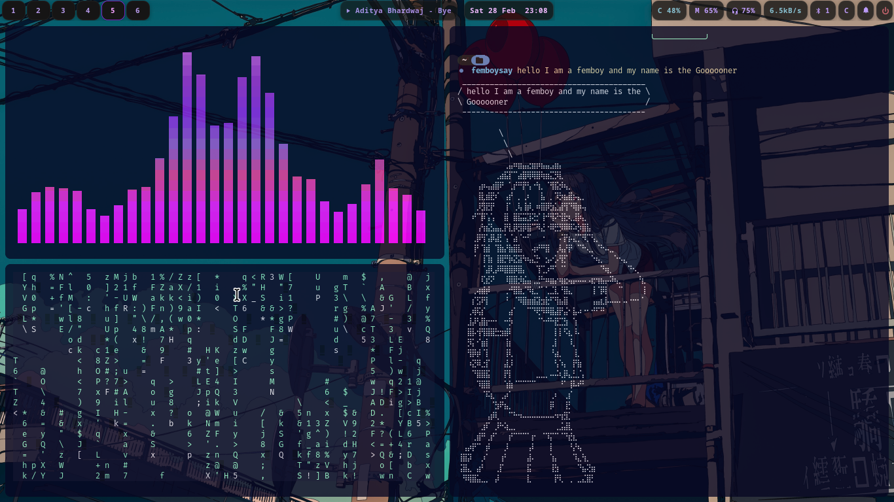

# Niri Minimal Dotfiles 🌿


> A highly configured, minimal, and aesthetic collection of dotfiles for the [Niri](https://github.com/YaLTeR/niri) scrollable tiling window manager. 

This setup focuses on a clean **"Noctalia"** dark theme, modular configuration, and a keyboard-centric workflow. Everything is designed to work together seamlessly with a consistent color palette and typography.
---

## 📸 Gallery

If you are just browsing, here is what this setup looks like.

| **Desktop & Waybar** | **Window Overview** |
|:---:|:---:|
|  |  |
| *Clean desk with modular Waybar* | *Niri's scrollable window overview* |
| **Wallpaper picker** | **Lazy Vim** |
|:---:|:---:|
|  |  |
| *Fuzzel wallpaper picker* | *Lazygit terminal UI* |

| **OBS Studio** | **Btop System Monitor** |
|:---:|:---:|
|  |  |
| *OBS Studio with Normal theme* | *Btop with Glassy Frost theme* |


| **Terminal (Alacritty)** | **File Manager (Ranger)** |
|:---:|:---:|
|  |  |
| *Alacritty + Fish + Starship* | *Ranger console file manager* |

| **Audio Visualizer** | **Obsidian Notes** |
|:---:|:---:|
|  |  |
| *Custom Cava visualizer* | *Knowledge base & notes* |

| **Game Dev (Godot)** | **Communication (Discord)** |
|:---:|:---:|
|  |  |
| *Godot Engine themed* | *Discord client* |

| **Main Landing Page** |
|:---:|
|  |
| *Main landing page with custom wallpaper* |
---

## 🧩 Components

Detailed list of all applications and tools configured in this repository.

| **Category** | **Application** | **Config Path** | **Description** |
|:---:|:---|:---|:---|
| **Window Manager** | [Niri](https://github.com/YaLTeR/niri) | `niri/` | Infinite scrolling tiling WM for Wayland. |
| **Status Bar** | [Waybar](https://github.com/Alexays/Waybar) | `waybar/` | Highly customizable modular status bar. |
| **Terminal** | [Alacritty](https://github.com/alacritty/alacritty) | `alacritty/` | GPU-accelerated terminal emulator. |
| **Shell** | [Fish](https://fishshell.com/) | `fish/` | User-friendly command line shell. |
| **Prompt** | [Starship](https://starship.rs/) | `prompt/` | Cross-shell customizable prompt. |
| **Editor** | [Neovim](https://neovim.io/) | `nvim/` | Powered by [NvChad](https://nvchad.com) v2.5. |
| **Launcher** | [Fuzzel](https://codeberg.org/dnkl/fuzzel) | `fuzzel/` | Wayland-native application launcher. |
| **System Monitor** | [Btop](https://github.com/aristocratos/btop) | `btop/` | Resource monitor (Glassy Frost / Material You themes). |
| **File Manager** | [Yazi](https://github.com/sxyazi/yazi) | `yazi/` | Blazing fast terminal file manager (Rust). |
|  | [Ranger](https://github.com/ranger/ranger) | `ranger/` | VIM-inspired file manager. |
|  | [Nautilus](https://apps.gnome.org/Nautilus/) | `nautilus/` | GUI file manager integration. |
| **Notifications** | [Mako](https://github.com/emersion/mako) | `mako/` | Lightweight notification daemon. |
| **Lock Screen** | [Swaylock](https://github.com/swaywm/swaylock) | `swaylock/` | Screen locker for Wayland. |
| **Logout Menu** | [Wlogout](https://github.com/ArtsyMacaw/wlogout) | `wlogout/` | Wayland based logout menu. |
| **Media Player** | [MPV](https://mpv.io/) | `mpv/` | Video player with `modernz` script. |
| **Visualizer** | [Cava](https://github.com/karlstav/cava) | `cava/` | Console-based audio visualizer with shaders. |
| **Screenshot** | [Swappy](https://github.com/jomo/swappy) | `swappy/` | Wayland native snapshot editing tool. |
| **Git Client** | [Lazygit](https://github.com/jesseduffield/lazygit) | `lazygit/` | Simple terminal UI for git commands. |
| **Notes** | [Obsidian](https://obsidian.md/) | `obsidian/` | Knowledge base configuration. |
| **Multiplexer** | [Tmux](https://github.com/tmux/tmux) | `tmux/` | Terminal multiplexer. |
| **Productivity** | [Pomoru](https://github.com/fry69/pomoru) | `pomoru/` | Pomodoro timer. |

---

## ⌨️ Keybindings

Essential keybindings for navigating the Niri environment. See `niri/keybinds.kdl` for the full list.

| **Key Combination** | **Action** |
|:---|:---|
| <kbd>Mod</kbd> + <kbd>Return</kbd> | Open Terminal (`Alacritty`) |
| <kbd>Mod</kbd> + <kbd>Space</kbd> | Open App Launcher (`Fuzzel`) |
| <kbd>Mod</kbd> + <kbd>C</kbd> | Open VS Code (`Code`) |
| <kbd>Mod</kbd> + <kbd>B</kbd> | Open Browser (`Brave`) |
| <kbd>Mod</kbd> + <kbd>E</kbd> | Open File Manager (`Nautilus`) |
| <kbd>Mod</kbd> + <kbd>T</kbd> | Power Menu (`Wlogout`) |
| <kbd>Super</kbd> + <kbd>Alt</kbd> + <kbd>L</kbd> | Lock Screen (`Swaylock`) |
| <kbd>Mod</kbd> + <kbd>Shift</kbd> + <kbd>/</kbd> | Show Hotkey Overlay |
| <kbd>XF86AudioRaiseVolume</kbd> | Volume Up |
| <kbd>XF86AudioLowerVolume</kbd> | Volume Down |
| <kbd>XF86AudioPlay</kbd> | Play/Pause Media |

---

## 🛠️ Installation

### 1. Requirements
Ensure you have the required packages installed. On Arch Linux:
```bash
sudo pacman -S niri waybar alacritty fish starship neovim btop yazi ranger fuzzel mako swaylock wlogout mpv cava swappy tmux lazygit
```

### 2. Clone Repository
Clone this repository to your minimal dotfiles folder (or directly to `.config` if you prefer manual management, though using `stow` is recommended).

```bash
git clone https://github.com/youngcoder45/new-niri-minimal.git
cd new-niri-minimal
```

### 3. Deploy Configs
Copy the folders to your `~/.config/` directory.

```bash
cp -r niri waybar alacritty fish btop fuzzel mako swaylock wlogout ~/.config/
# Add others as needed
```

*Note: For the scripts and custom themes to work correctly, ensure you have the `prompt` folder configured and fonts installed (Nerd Fonts recommended).*

---

## ⚙️ Features

- **Modular Waybar:** `waybar/modules/` splits configuration for easier editing.
- **Custom ZSH-like Fish:** Experience the power of Fish with a setup that feels like a turbocharged ZSH.
- **NvChad Integrated:** Drop-in replacement for standard Nvim config.
- **Unified Theming:** **Noctalia** theme consistency across terminal, window manager, and UI apps.
- **Hardware Acceleration:** Configured for optimal performance on supported GPUs.

---

## 🔮 Future Plans

- [ ]  Add Dark / Light mode toggle script
- [ ]  Improve `swaylock` visual effects
- [ ]  Create an automated installation script (`install.sh`)
- [ ]  Add more color schemes (Nord, Catppuccin, Gruvbox)
- [ ]  Integrate `rofi` as an alternative launcher

---

## 🤝 Contributing

Contributions are welcome! If you have any improvements, bug fixes, or new feature ideas, please feel free to contribute.

1.  **Fork** the repository.
2.  **Clone** your fork locally.
3.  **Create a new branch** for your feature or fix.
4.  **Commit** your changes with clear messages.
5.  **Push** to your fork and submit a **Pull Request**.

Please ensure your code follows the existing style and conventions.

---

## ⭐ Star History

If you find this repository useful, please consider giving it a star!

[](https://star-history.com/#youngcoder45/New-Niri-minimal-dots&Date)

---

## Credits

- **Wallpaper:** "Rogue" (Located in `niri/autostart.sh`)
- **Theme:** Noctalia / Dank Theme / Glassy Frost
