<p align="center">
  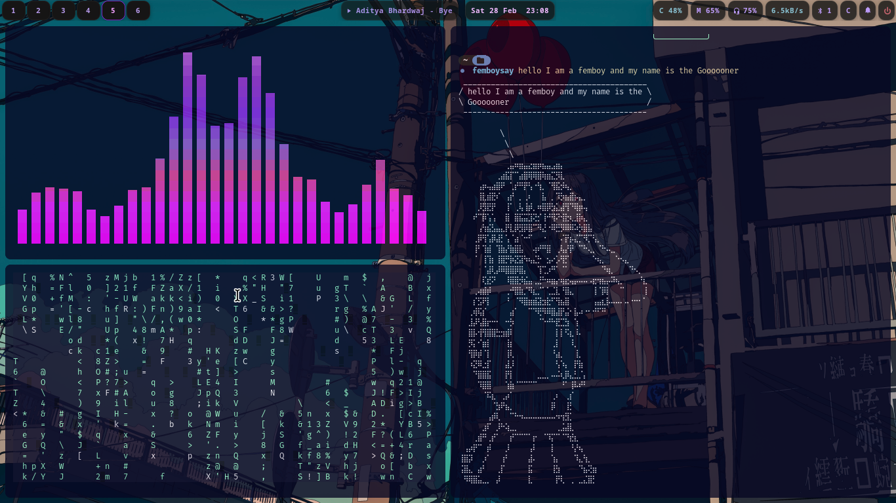
</p>

<h1 align="center">Niri Dotfiles</h1>

<p align="center">
  A complete, reproducible <a href="https://github.com/YaLTeR/niri">Niri</a> Wayland desktop environment for Arch Linux.
</p>

<p align="center">
  
  
  
</p>

---

## Preview

| Desktop | Tiled | Waybar |
|---------|-------|--------|
| 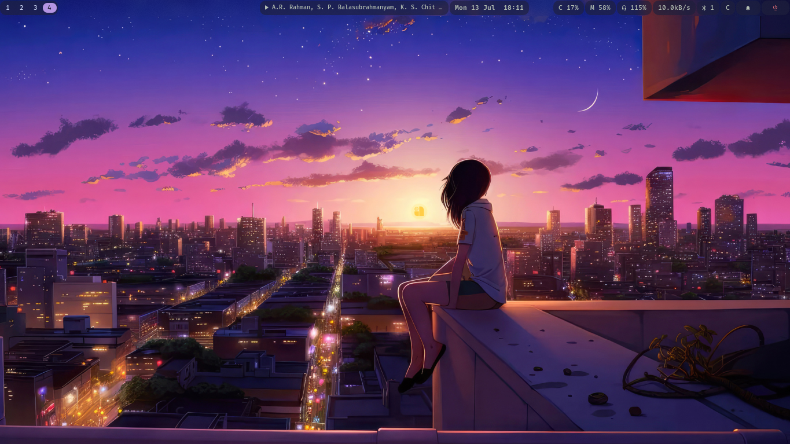 | 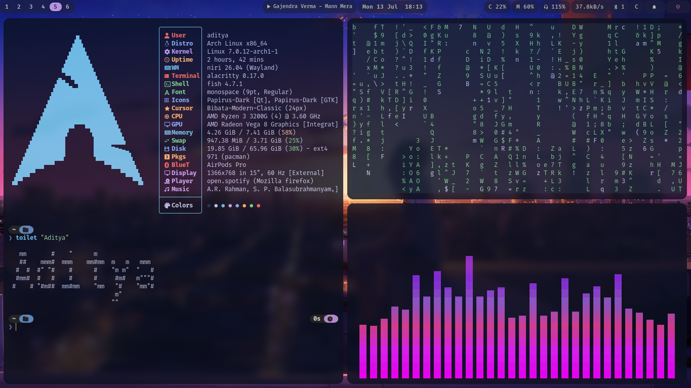 | 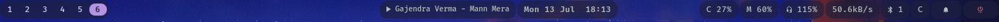 |

| Launcher | Workspaces | Zed |
|----------|------------|-----|
| 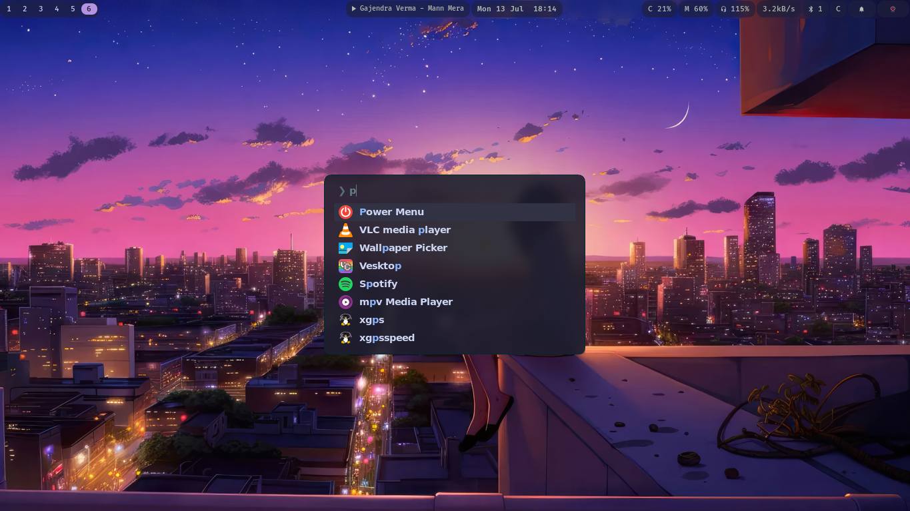 | 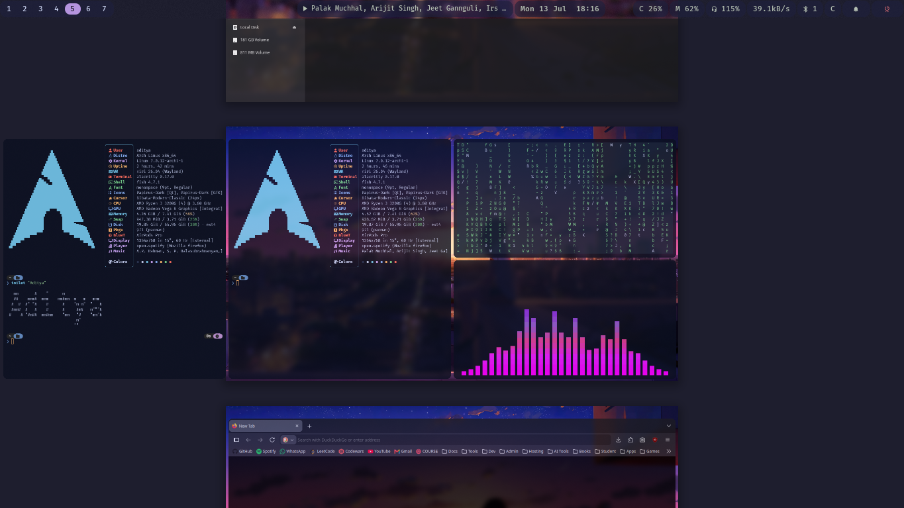 | 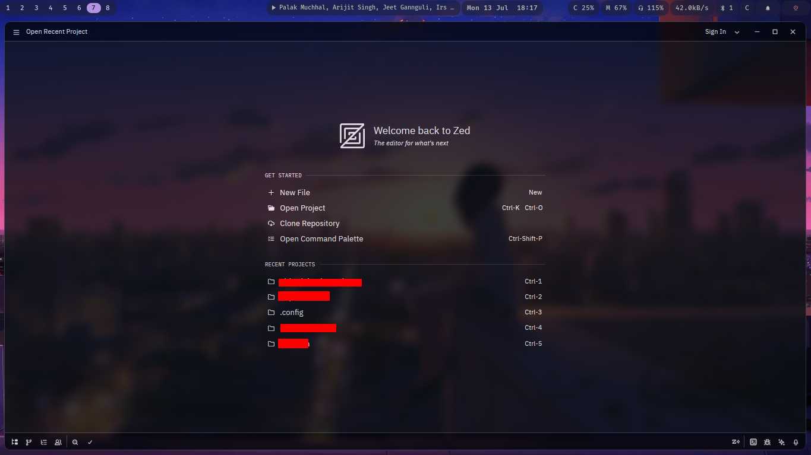 |

| Neovim | Power Menu | Wallpaper Picker |
|--------|------------|------------------|
| 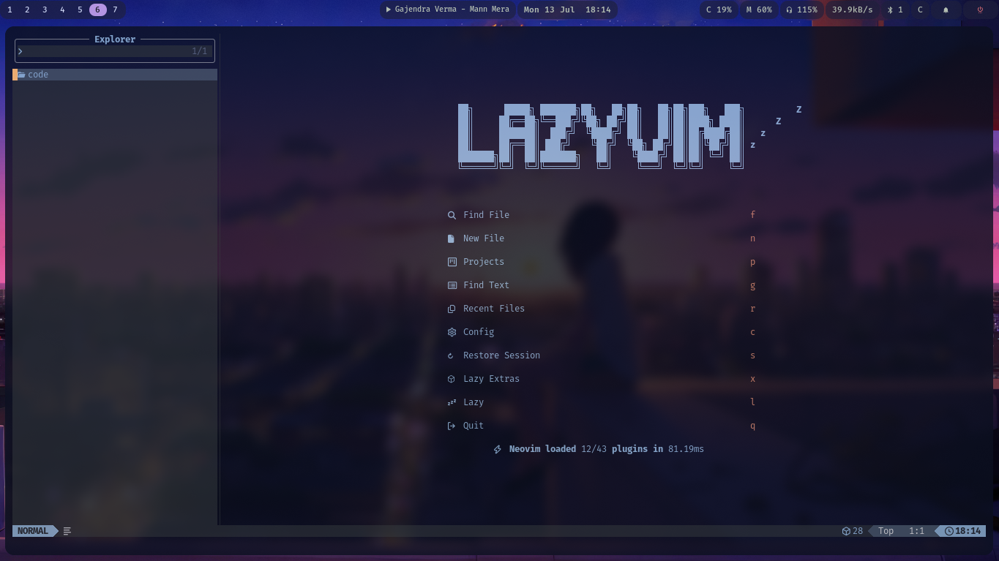 | 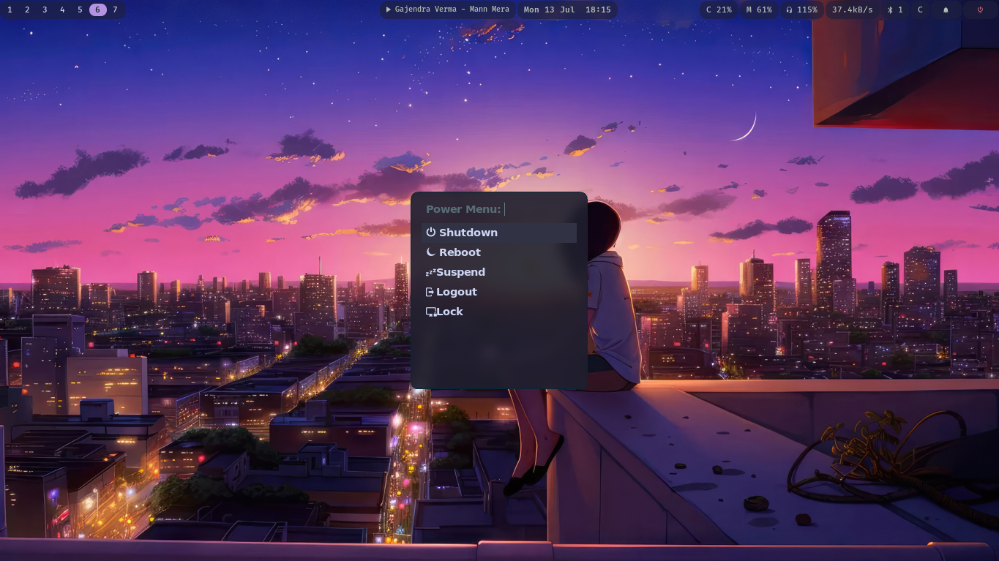 | 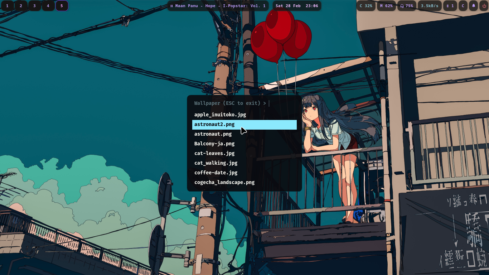 |

| btop | Cava |
|------|------|
| 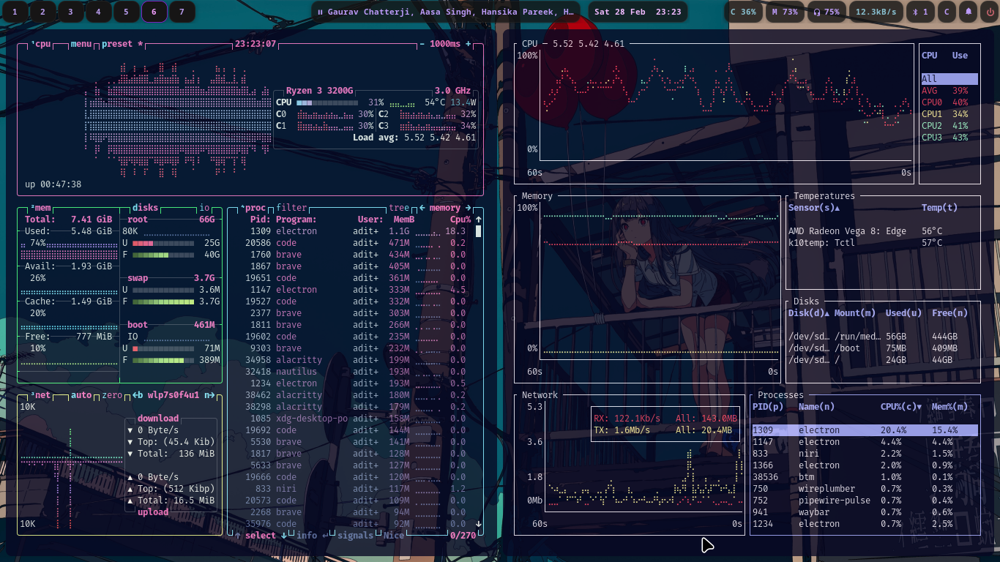 | 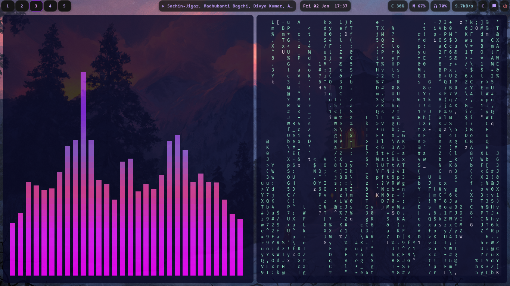 |

---

## What's Included

This repository reproduces a complete Niri desktop environment from a fresh Arch Linux install. It includes:

- **Niri** — scrollable tiling compositor with blur, animations, and rounded corners
- **Waybar** — modular status bar with player, clipboard, notifications, CPU, memory, power
- **Fuzzel** — fast Wayland-native application launcher
- **Mako** — notification daemon with sakura rice theme
- **Fish** — smart shell with Starship prompt
- **Alacritty + Kitty** — dual terminal setup
- **Custom scripts** — power menu, wallpaper picker, clipboard history, notification history
- **MIME associations** — PDF, images, code, archives, media all configured
- **Portal configuration** — screen sharing and screenshots working out of the box
- **GTK/Qt theming** — adw-gtk3-dark, Papirus-Dark icons, Bibata cursor

---

## Quick Start

```bash
# Clone the repository
git clone https://github.com/youngcoder45/New-Niri-minimal-dots
cd New-Niri-minimal-dots

# Run the installer (installs packages, symlinks configs, sets up everything)
chmod +x install.sh
./install.sh

# Reboot
sudo reboot
```

That's it. The installer handles:
- Package installation (pacman + AUR via yay)
- Config symlinking with backups
- MIME associations
- Wallpaper installation
- Portal configuration
- Script permissions
- Fish as default shell
- SDDM enablement

---

## What the Installer Does

<details>
<summary><strong>Click to expand full install.sh behavior</strong></summary>

1. **Installs packages** from `packages.txt` via `pacman -S --needed`
2. **Installs yay** (AUR helper) if not present
3. **Installs AUR packages** via yay (niri-git, brave-bin, vesktop-bin, etc.)
4. **Creates directories** (`~/.config`, `~/.local/bin`, `~/Pictures/wallpapers`)
5. **Symlinks all config directories** from the repo to `~/.config/` (backs up existing)
6. **Links local/bin scripts** to `~/.local/bin/`
7. **Installs wallpapers** from `wallpapers/` to `~/Pictures/wallpapers/`
8. **Installs MIME associations** (`mimeapps.list` → `~/.config/`)
9. **Installs portal configs** (`xdg-desktop-portal/*.conf` → `~/.config/xdg-desktop-portal/`)
10. **Fixes hardcoded paths** — replaces `__HOME__` with actual `$HOME` in all config files
11. **Sets Fish as default shell**
12. **Enables SDDM** display manager
13. **Sets executable permissions** on all scripts

</details>

---

## Keybindings

### Applications

| Keybinding | Action |
|------------|--------|
| `Mod + Return` | Open terminal (Alacritty) |
| `Alt + Return` | Open terminal (Kitty) |
| `Mod + Space` | Application launcher (Fuzzel) |
| `Mod + B` | Open browser (Firefox) |
| `Mod + C` | Open code editor (VS Code) |
| `Mod + V` | Open Vesktop (Discord) |
| `Mod + E` | Open file manager (Nautilus) |
| `Mod + Z` | Open Zed editor |
| `Mod + T` | Power menu (Wlogout) |
| `Mod + P` | Power menu (Fuzzel-based) |
| `Print` | Screenshot (Flameshot GUI) |

### Window Management

| Keybinding | Action |
|------------|--------|
| `Mod + Q` | Close window |
| `Mod + F` | Maximize column |
| `Mod + Shift + F` | Fullscreen window |
| `Mod + D` | Toggle floating |
| `Mod + Shift + V` | Switch focus floating/tiling |
| `Mod + W` | Toggle tabbed column |
| `Mod + R` | Cycle column width |
| `Mod + O` | Toggle overview |
| `Mod + H/L` | Focus left/right |
| `Mod + J/K` | Focus window down/up |
| `Mod + Ctrl + H/J/K/L` | Move window |

### Workspaces

| Keybinding | Action |
|------------|--------|
| `Mod + 1-9` | Switch to workspace 1-9 |
| `Mod + Ctrl + 1-9` | Move window to workspace 1-9 |
| `Mod + U/I` | Workspace down/up |
| `Mod + Ctrl + U/I` | Move window to workspace down/up |
| `Mod + Page_Down/Up` | Workspace down/up |

### Monitors

| Keybinding | Action |
|------------|--------|
| `Mod + Shift + H/J/K/L` | Focus monitor left/down/up/right |
| `Mod + Shift + Ctrl + H/J/K/L` | Move window to monitor |

### Media Keys

| Keybinding | Action |
|------------|--------|
| `XF86AudioRaise/Lower` | Volume up/down |
| `XF86AudioMute` | Toggle mute |
| `XF86AudioMicMute` | Toggle mic mute |
| `XF86AudioPlay/Prev/Next` | Media controls |
| `XF86BrightnessUp/Down` | Brightness up/down |

### Screenshots

| Keybinding | Action |
|------------|--------|
| `Print` | Screenshot (Flameshot GUI) |
| `Ctrl + Print` | Screenshot (current output) |
| `Alt + Print` | Screenshot (current window) |

---

## Custom Scripts

### `~/.local/bin/` Scripts

| Script | Description | Dependencies |
|--------|-------------|--------------|
| `powermenu` | Fuzzel-based power menu (Shutdown/Reboot/Suspend/Logout/Lock) | fuzzel, systemctl, niri-lock |
| `set-wallpaper` | Interactive wallpaper picker using Fuzzel | fuzzel, swaybg |
| `clipboard-history` | Browse and select from clipboard history | cliphist, fuzzel, wl-copy |
| `notification-history` | Browse notification history | fuzzel, makoctl |
| `mako-history` | View Mako notification log | fuzzel |

### Waybar Scripts (`waybar/scripts/`)

| Script | Description |
|--------|-------------|
| `powermenu.sh` | Power menu triggered from waybar |
| `clipboard.sh` | Clipboard history/clear from waybar |
| `bluetooth-control.sh` | Bluetooth device picker with Fuzzel |
| `bluetooth.sh` | Bluetooth status display |
| `volume-control.sh` | Volume control with device selection |
| `network-control.sh` | Network manager with WiFi scanning |
| `notification-control.sh` | Notification history (Python, uses makoctl) |
| `notifications.sh` | Notification count display |
| `mediaplayer.sh` | Media player status (playerctl) |
| `launch-waybar.sh` | Waybar launcher with warning suppression |

---

## MIME Associations

Configured in `mimeapps.list`:

| Type | Default App |
|------|------------|
| PDF | Zathura |
| JPEG/PNG/WEBP/GIF | Loupe |
| SVG | Firefox |
| Markdown | Obsidian |
| Plain text | Zed |
| CSV / XLS / XLSX | Gnumeric |
| YAML | Zed |
| HTML | Firefox |
| Video (mp4) | mpv |
| Audio (mp3) | mpv |
| Archives (zip) | FreesmLauncher |
| Archives (tar) | FileRoller |
| Directories | Nautilus |
| HTTP/HTTPS | Firefox |
| Discord links | Vesktop |

---

## Portal Configuration

Screen sharing and screenshots work via `xdg-desktop-portal-gnome`. The repository includes:

- `xdg-desktop-portal/niri-portals.conf` — Routes ScreenCast and Screenshot to GNOME backend
- `xdg-desktop-portal/portals.conf` — General fallback (FileChooser/OpenURI/Print → GTK)

These are installed to `~/.config/xdg-desktop-portal/` by the installer.

---

## Fonts

The following fonts are required (installed by `packages.txt`):

| Font | Package | Used By |
|------|---------|---------|
| FiraCode Nerd Font | `ttf-firacode-nerd` | Alacritty, Kitty, Waybar |
| JetBrainsMono Nerd Font | `ttf-jetbrains-mono-nerd` | Mako notifications |
| Symbols Nerd Font | `ttf-nerd-fonts-symbols` | Waybar icon fallback |
| Noto Sans Emoji | `noto-fonts-emoji` | Emoji rendering |
| DejaVu Sans | (base system) | Fuzzel launcher |

---

## Themes

| Component | Theme / Style |
|-----------|--------------|
| GTK Theme | adw-gtk3-dark |
| Icon Theme | Papirus-Dark |
| Cursor Theme | Bibata-Modern-Classic |
| Waybar | Catppuccin Mocha (custom) |
| Alacritty | Deep navy with sunset accents |
| Kitty | Glassy Frost Dracula-inspired |
| Mako | Sakura rice (pink/purple) |
| Fuzzel | Catppuccin Mocha overlay |

---

## Directory Structure

```
.
├── alacritty/
│   └── alacritty.toml           # Terminal config (deep navy theme)
├── bottom/
│   └── bottom.toml              # System monitor
├── btop/
│   └── btop.conf                # System monitor (glassy frost theme)
├── cava/
│   ├── config                   # Audio visualizer
│   ├── shaders/
│   └── themes/
├── environment.d/
│   ├── cursors.conf             # XCURSOR_THEME, XCURSOR_SIZE
│   └── unset-gtk-theme.conf     # Clears GTK_THEME env
├── fastfetch/
│   └── config.jsonc             # System info display
├── fish/
│   ├── config.fish              # Fish shell config
│   └── conf.d/                  # Theme, keybindings, auto-ls
├── flameshot/
│   └── flameshot.ini            # Screenshot tool
├── fuzzel/
│   └── fuzzel.ini               # App launcher (DejaVu Sans, Catppuccin)
├── godot/
│   └── editor_settings-4.5.tres # Godot editor settings
├── gtk-3.0/
│   ├── settings.ini             # GTK3 settings
│   ├── gtk.css
│   ├── colors.css
│   └── bookmarks
├── gtk-4.0/
│   ├── settings.ini             # GTK4 settings
│   └── colors.css
├── kitty/
│   ├── kitty.conf               # Kitty terminal (Glassy Frost theme)
│   ├── colors.conf
│   └── sessions/
├── lazygit/
│   └── config.yml               # Git TUI
├── local/bin/                   # Custom scripts
│   ├── powermenu                # Fuzzel power menu
│   ├── set-wallpaper            # Wallpaper picker
│   ├── clipboard-history        # Clipboard manager
│   ├── notification-history     # Notification viewer
│   └── mako-history             # Mako log viewer
├── mako/
│   └── config                   # Notifications (sakura rice theme)
├── mpv/
│   ├── mpv.conf                 # Media player
│   ├── fonts/
│   ├── script-opts/
│   └── scripts/
├── niri/
│   ├── config.kdl               # Main Niri config
│   ├── basicsettings.kdl        # Input, layout, animations
│   ├── keybinds.kdl             # All keybindings
│   ├── window_rules.kdl         # Per-app window rules
│   ├── autostart.sh             # Startup script
│   └── index.theme              # Cursor theme index
├── niri-lock/
│   ├── config.ini               # Lock screen config
│   ├── lock.sh                  # Lock script
│   └── style.css                # Lock screen styling
├── nvim/                        # LazyVim config
│   ├── init.lua
│   ├── lazy-lock.json
│   └── lua/
├── pomoru/
│   └── config.toml              # Pomodoro timer
├── qt6ct/
│   └── qt6ct.conf               # Qt6 theme
├── starship/
│   └── starship.toml            # Shell prompt
├── swappy/
│   └── config                   # Screenshot annotation
├── tmux/
│   └── tmux.conf                # Terminal multiplexer
├── vlc/
│   └── vlcrc                    # Media player
├── waybar/
│   ├── config.jsonc             # Bar config (11 modules)
│   ├── style.css                # Bar styling (Catppuccin Mocha)
│   ├── modules/                 # Individual module configs
│   └── scripts/                 # 10 custom scripts
├── wlogout/
│   ├── layout                   # Power menu layout
│   └── style.css                # Power menu styling
├── xdg-desktop-portal/
│   ├── niri-portals.conf        # Niri portal routing
│   └── portals.conf             # General portal fallback
├── zed/
│   ├── settings.json            # Zed editor
│   └── snippets/                # Code snippets
├── wallpapers/
│   ├── forest_dark_winter.jpg   # Default wallpaper
│   └── rogue.jpg                # Alternative wallpaper
├── mimeapps.list                # MIME associations
├── packages.txt                 # Package list (~150 packages)
├── install.sh                   # Automated installer
├── .gitignore
├── LICENSE
└── README.md
```

---

## Customization

### Change the Wallpaper

```bash
# Place images in ~/Pictures/wallpapers/
# Then use the picker:
~/.local/bin/set-wallpaper
```

Or edit `niri/autostart.sh` to change the default:
```bash
swaybg -i "$HOME/Pictures/wallpapers/your-wallpaper.jpg" -m fill &
```

### Change the Color Scheme

| File | Controls |
|------|----------|
| `waybar/style.css` | Waybar colors |
| `mako/config` | Notification colors |
| `alacritty/alacritty.toml` | Alacritty colors |
| `kitty/kitty.conf` | Kitty colors |
| `niri-lock/style.css` | Lock screen colors |
| `fuzzel/fuzzel.ini` | Launcher colors |

### Add Waybar Modules

Edit `waybar/config.jsonc` to add modules to `modules-left`, `modules-center`, or `modules-right`. Define new modules in `waybar/modules/`.

### Change Terminal Font

Edit `font_family` in `alacritty/alacritty.toml` or `font_family` in `kitty/kitty.conf`.

---

## Troubleshooting

### Waybar icons not showing
```bash
# Install the missing symbols font
sudo pacman -S ttf-nerd-fonts-symbols
fc-cache -fv
killall waybar && waybar &
```

### Waybar not showing
```bash
killall waybar
~/.config/waybar/scripts/launch-waybar.sh
```

### No notifications
```bash
killall mako
mako &
```

### Wallpaper not changing
```bash
# Test manually
swaybg -i ~/Pictures/wallpapers/your-wallpaper.jpg -m fill &
```

### Lock screen not working
```bash
# Test niri-lock
niri-lock
```

### Screen sharing not working
```bash
# Verify portal config
cat ~/.config/xdg-desktop-portal/niri-portals.conf
# Should show:
# [preferred]
# default=gnome
# org.freedesktop.impl.portal.ScreenCast=gnome
# org.freedesktop.impl.portal.Screenshot=gnome

# Restart portal
systemctl --user restart xdg-desktop-portal
systemctl --user restart xdg-desktop-portal-gnome
```

### Fonts look wrong
```bash
# Rebuild font cache
fc-cache -fv
# Verify fonts are found
fc-match "FiraCode Nerd Font Mono"
fc-match "JetBrainsMono Nerd Font"
```

---

## Applications

| Category | Application |
|----------|-------------|
| Compositor | [Niri](https://github.com/YaLTeR/niri) |
| Bar | [Waybar](https://github.com/Alexays/Waybar) |
| Launcher | [Fuzzel](https://codeberg.org/dnkl/fuzzel) |
| Terminal | [Alacritty](https://github.com/alacritty/alacritty) + [Kitty](https://sw.kovidgoyal.net/kitty/) |
| Shell | [Fish](https://fishshell.com/) |
| Prompt | [Starship](https://starship.rs/) |
| Notifications | [Mako](https://github.com/emersion/mako) |
| Lock Screen | [gtklock](https://github.com/jovanlanik/gtklock) (via niri-lock) |
| Power Menu | [Wlogout](https://github.com/nicoplv/wlogout) + Fuzzel custom |
| Clipboard | [Cliphist](https://github.com/sentriz/cliphist) + [wl-clipboard](https://github.com/bugaevc/wl-clipboard) |
| Screenshot | [Flameshot](https://flameshot.org/) |
| Wallpaper | [Swaybg](https://github.com/swaywm/swaybg) |
| File Manager | [Nautilus](https://apps.gnome.org/Nautilus/) + [nnn](https://github.com/jarun/nnn) |
| Code Editor | [Neovim](https://neovim.io/) (LazyVim) + [VS Code](https://code.visualstudio.com/) + [Zed](https://zed.dev/) |
| Browser | [Brave](https://brave.com/) + [Firefox](https://www.mozilla.org/) |
| Media Player | [mpv](https://mpv.io/) + [VLC](https://www.videolan.org/) |
| System Monitor | [Bottom](https://github.com/ClementTsang/bottom) + [btop](https://github.com/aristocratos/btop) |
| Audio Visualizer | [Cava](https://github.com/kornerc/cava) |
| Git UI | [Lazygit](https://github.com/jesseduffield/lazygit) |
| System Info | [Fastfetch](https://github.com/fastfetch-cli/fastfetch) |
| Pomodoro | [Pomoru](https://github.com/animeai/pomoru) |
| Discord | [Vesktop](https://github.com/Vencord/Vesktop) |
| PDF Viewer | [Zathura](https://github.com/pwmt/zathura) |
| Image Viewer | [Loupe](https://gitlab.gnome.org/Incubate/Loupe) |
| Display Manager | [SDDM](https://github.com/sddm/sddm) (sugar-candy theme) |

---

## Credits

- [Niri](https://github.com/YaLTeR/niri) — Wayland compositor
- [Waybar](https://github.com/Alexays/Waybar) — Status bar
- [Fuzzel](https://codeberg.org/dnkl/fuzzel) — Application launcher
- [Catppuccin](https://github.com/catppuccin/catppuccin) — Color scheme inspiration
- [LazyVim](https://github.com/LazyVim/LazyVim) — Neovim config

---

## License

This project is licensed under the MIT License — see the [LICENSE](LICENSE) file for details.

---

<p align="center">
  Made with ❤️ by <a href="https://github.com/youngcoder45">Aditya Verma</a>
</p>
