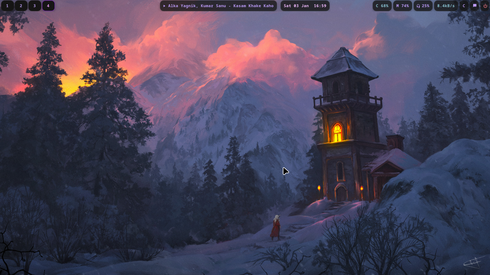
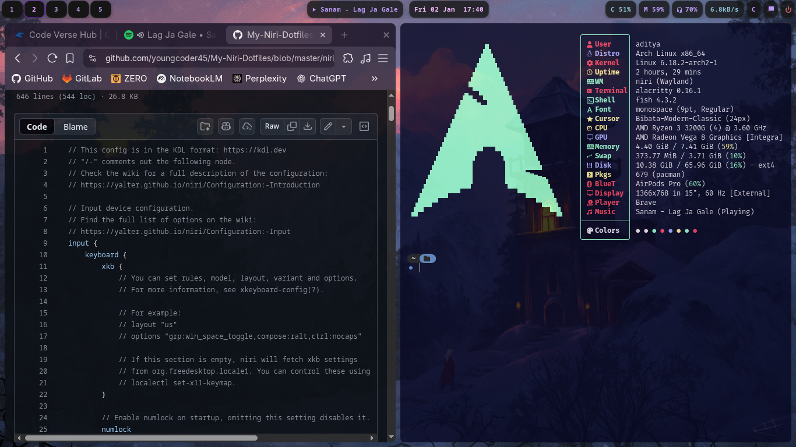
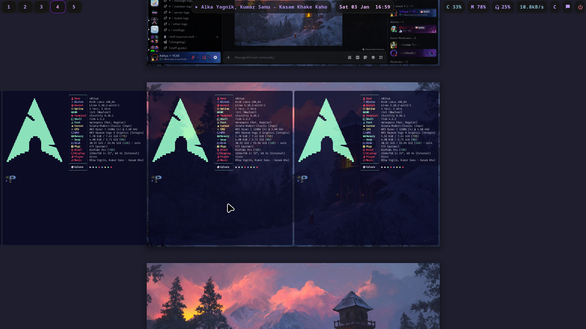
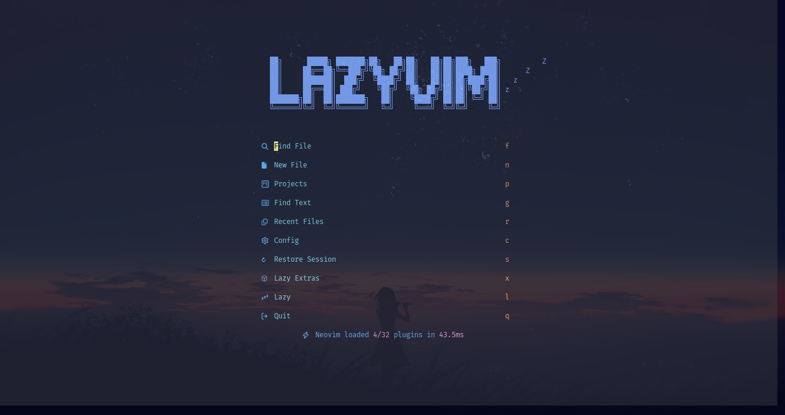

<p align="center">
  
</p>

<h1 align="center">Niri Minimal Dots</h1>

<p align="center">
  A clean, minimal <a href="https://github.com/YaLTeR/niri">Niri</a> Wayland compositor configuration for Arch Linux with Tokyo Night theme.
</p>

<p align="center">
  
  
  
</p>

---

## Preview

| Desktop | Terminal | Waybar |
|---------|----------|--------|
|  |  |  |

| Launcher | Wallpaper Picker | Power Menu |
|----------|-----------------|------------|
|  |  |  |

---

## Features

- **Niri** — scrollable tiling Wayland compositor
- **Waybar** — modular status bar with 15+ modules
- **Fuzzel** — fast Wayland-native application launcher
- **Fish** — smart shell with syntax highlighting and completions
- **Tokyo Night** — cohesive color scheme across all components
- **Custom scripts** — volume, bluetooth, network, weather, clipboard, and more
- **Random wallpapers** — new wallpaper on every login
- **Minimal footprint** — no unnecessary bloat

---

## Applications Used

| Category | Application |
|----------|-------------|
| Compositor | [Niri](https://github.com/YaLTeR/niri) |
| Bar | [Waybar](https://github.com/Alexays/Waybar) |
| Launcher | [Fuzzel](https://codeberg.org/dnkl/fuzzel) |
| Terminal | [Alacritty](https://github.com/alacritty/alacritty) |
| Shell | [Fish](https://fishshell.com/) |
| Prompt | [Starship](https://starship.rs/) |
| Notification Daemon | [Mako](https://github.com/emersion/mako) |
| Lock Screen | [Swaylock](https://github.com/swaywm/swaylock) |
| Power Menu | [Wlogout](https://github.com/nicoplv/wlogout) |
| Clipboard | [Cliphist](https://github.com/sentriz/cliphist) + [wl-clipboard](https://github.com/bugaevc/wl-clipboard) |
| Screenshot | Niri built-in + [Swappy](https://github.com/jtheo/swappy) |
| Wallpaper | [Swaybg](https://github.com/swaywm/swaybg) |
| File Manager | [nnn](https://github.com/jarun/nnn) |
| Code Editor | [Neovim](https://neovim.io/) + [VS Code](https://code.visualstudio.com/) |
| Browser | [Brave](https://brave.com/) |
| Media Player | [mpv](https://mpv.io/) + [VLC](https://www.videolan.org/) |
| System Monitor | [Bottom](https://github.com/ClementTsang/bottom) + [btop](https://github.com/aristocratos/btop) |
| Audio Visualizer | [Cava](https://github.com/kornerc/cava) |
| Git UI | [Lazygit](https://github.com/jesseduffield/lazygit) |
| System Info | [Fastfetch](https://github.com/fastfetch-cli/fastfetch) |
| Pomodoro | [Pomoru](https://github.com/animeai/pomoru) |
| Network | [NetworkManager](https://networkmanager.dev/) |
| Bluetooth | [BlueZ](https://www.bluez.org/) |

---

## Installation

### Prerequisites

- Fresh Arch Linux installation
- Internet connection
- SDDM display manager (recommended)

### Quick Start

```bash
# Clone the repository
git clone https://github.com/youngcoder45/New-Niri-minimal-dots.git ~/.config
cd ~/.config

# Run the installer
chmod +x install.sh
./install.sh

# Reboot
sudo reboot
```

### Manual Installation

```bash
# Install packages
sudo pacman -S --needed - < packages.txt

# Install yay (AUR helper)
git clone https://aur.archlinux.org/yay-bin.git /tmp/yay-bin
cd /tmp/yay-bin && makepkg -si

# Install AUR packages
yay -S ttf-firacode-nerd papirus-icon-theme bibata-cursor-theme tokyo-night-gtk-theme

# Symlink configs (example for niri)
ln -sfn ~/.config/niri ~/.config/niri

# Set fish as default shell
chsh -s /usr/bin/fish
```

---

## Dependencies

### Required Packages

```
niri waybar fuzzel mako wlogout swaylock swaybg
alacritty fish starship fastfetch
wl-clipboard cliphist
pipewire pipewire-pulse pipewire-alsa wireplumber playerctl pamixer pavucontrol cava
brightnessctl
bluez bluez-utils
networkmanager network-manager-applet
grim slurp swappy imagemagick
nnn nnn-plugins
neovim git lazygit
bottom btop
mpv
eza bat fd ripgrep fzf zoxide jq unzip p7zip unrar less tree
ttf-firacode-nerd noto-fonts noto-fonts-emoji noto-fonts-cjk
polkit-gnome gnome-keyring
```

### AUR Packages

```
ttf-firacode-nerd
papirus-icon-theme
bibata-cursor-theme
tokyo-night-gtk-theme
```

---

## Fonts

| Font | Used In |
|------|---------|
| FiraCode Nerd Font | Alacritty, Fuzzel, Swaylock |

Install with: `sudo pacman -S ttf-firacode-nerd`

---

## Themes

| Component | Theme |
|-----------|-------|
| GTK Theme | Tokyo Night |
| QT Theme | Tokyo Night |
| Icon Theme | Papirus |
| Cursor Theme | Bibata-Modern-Classic |
| Color Scheme | Tokyo Night |

---

## Directory Structure

```
├── alacritty/          # Terminal configuration
│   └── alacritty.toml
├── bottom/             # System monitor
│   └── bottom.toml
├── cava/               # Audio visualizer
│   ├── config
│   ├── shaders/
│   └── themes/
├── fastfetch/          # System info display
│   └── config.jsonc
├── fish/               # Shell configuration
│   ├── config.fish
│   └── conf.d/
│       └── custom.fish
├── fuzzel/             # Application launcher
│   └── fuzzel.ini
├── godot/              # Game engine settings
│   └── editor_settings-4.5.tres
├── lazygit/            # Git TUI
│   └── config.yml
├── mako/               # Notification daemon
│   └── config
├── mpv/                # Media player
│   ├── mpv.conf
│   ├── fonts/
│   ├── script-opts/
│   └── scripts/
├── niri/               # Window manager
│   ├── config.kdl
│   ├── basicsettings.kdl
│   ├── keybinds.kdl
│   └── autostart.sh
├── nvim/               # Code editor
│   └── init.lua
├── pomoru/             # Pomodoro timer
│   └── config.toml
├── prompt/             # Shell prompt
│   └── starship.toml
├── swappy/             # Screenshot annotation
│   └── config
├── swaylock/           # Lock screen
│   └── config
├── tmux/               # Terminal multiplexer
│   └── tmux.conf
├── vlc/                # Media player
│   └── vlcrc
├── waybar/             # Status bar
│   ├── config.jsonc
│   ├── style.css
│   ├── themes/
│   ├── modules/
│   └── scripts/
├── wlogout/            # Power menu
│   ├── layout
│   ├── style.css
│   └── icons/
├── wallpapers/         # Wallpaper storage
├── screenshots/        # Repository screenshots
├── packages.txt        # Package list
├── install.sh          # Installation script
├── LICENSE             # MIT License
└── README.md           # This file
```

---

## Keybindings

### Applications

| Keybinding | Action |
|------------|--------|
| `Mod + Return` | Open terminal (Alacritty) |
| `Mod + Space` | Application launcher (Fuzzel) |
| `Mod + B` | Open browser (Brave) |
| `Mod + C` | Open code editor (VS Code) |
| `Mod + D` | Open Discord (Vesktop) |
| `Mod + E` | Open file manager (Nautilus) |
| `Super + Alt + L` | Lock screen (Swaylock) |
| `Mod + Shift + Q` | Power menu (Wlogout) |

### Window Management

| Keybinding | Action |
|------------|--------|
| `Mod + Q` | Close window |
| `Mod + F` | Maximize column |
| `Mod + Shift + F` | Fullscreen window |
| `Mod + V` | Toggle floating |
| `Mod + Shift + V` | Switch focus floating/tiling |
| `Mod + W` | Toggle tabbed column |
| `Mod + R` | Cycle column width |
| `Mod + H/J/K/L` | Focus left/down/up/right |
| `Mod + Ctrl + H/J/K/L` | Move window left/down/up/right |

### Workspaces

| Keybinding | Action |
|------------|--------|
| `Mod + 1-9` | Switch to workspace 1-9 |
| `Mod + Ctrl + 1-9` | Move window to workspace 1-9 |
| `Mod + U/I` | Workspace down/up |
| `Mod + Ctrl + U/I` | Move window to workspace down/up |

### Monitors

| Keybinding | Action |
|------------|--------|
| `Mod + Shift + H/J/K/L` | Focus monitor left/down/up/right |
| `Mod + Shift + Ctrl + H/J/K/L` | Move window to monitor |

### Media Keys

| Keybinding | Action |
|------------|--------|
| `XF86AudioRaise/Lower` | Volume up/down |
| `XF86AudioMute` | Toggle mute |
| `XF86AudioMicMute` | Toggle mic mute |
| `XF86AudioPlay/Prev/Next` | Media controls |
| `XF86BrightnessUp/Down` | Brightness up/down |

### Screenshots

| Keybinding | Action |
|------------|--------|
| `Print` | Screenshot (all outputs) |
| `Ctrl + Print` | Screenshot (current output) |
| `Alt + Print` | Screenshot (current window) |

---

## Scripts

All custom scripts are in `waybar/scripts/`:

| Script | Description |
|--------|-------------|
| `powermenu.sh` | Fuzzel-based power menu |
| `clipboard.sh` | Cliphist clipboard manager |
| `bluetooth-control.sh` | Bluetooth device picker |
| `bluetooth.sh` | Bluetooth status display |
| `volume-control.sh` | Volume control with device selection |
| `network-control.sh` | Network manager with WiFi scanning |
| `weather.sh` | Weather display (wttr.in) |
| `updates.sh` | Package update checker |
| `notifications.sh` | Notification count display |
| `battery-info.sh` | Battery information |
| `mediaplayer.sh` | Media player status |
| `launch-waybar.sh` | Waybar launcher |
| `cava_to_waybar.py` | Cava visualizer for Waybar |

---

## FAQ

### Q: How do I change the wallpaper?

Place images in `~/Pictures/wallpapers/`. A random wallpaper will be selected on login.

### Q: How do I change the color scheme?

Edit the color values in:
- `waybar/themes/colors.css` — Waybar colors
- `waybar/style.css` — Waybar styling
- `mako/config` — Notification colors
- `fish/config.fish` — Fish syntax highlighting
- `swaylock/config` — Lock screen colors

### Q: How do I add more Waybar modules?

Edit `waybar/config.jsonc` and add modules to `modules-left`, `modules-center`, or `modules-right`. Module definitions are in `waybar/modules/`.

### Q: How do I change the terminal font?

Edit `alacritty/alacritty.toml` and modify the `[font]` section.

---

## Troubleshooting

### Waybar not showing
```bash
killall waybar
~/.config/waybar/scripts/launch-waybar.sh
```

### No notifications
```bash
killall mako
mako &
```

### Wallpaper not changing
```bash
# Test manually
swaybg -i ~/Pictures/wallpapers/your-wallpaper.jpg -m fill &
```

---

## Credits

- [Niri](https://github.com/YaLTeR/niri) — Wayland compositor
- [Waybar](https://github.com/Alexays/Waybar) — Status bar
- [Fuzzel](https://codeberg.org/dnkl/fuzzel) — Application launcher
- [Tokyo Night](https://github.com/enkia/tokyo-night-vscode-theme) — Color scheme inspiration
- [Catppuccin](https://github.com/catppuccin/catppuccin) — Fish shell colors

---

## License

This project is licensed under the MIT License — see the [LICENSE](LICENSE) file for details.

---

<p align="center">
  Made with ❤️ by <a href="https://github.com/youngcoder45">Aditya Verma</a>
</p>
